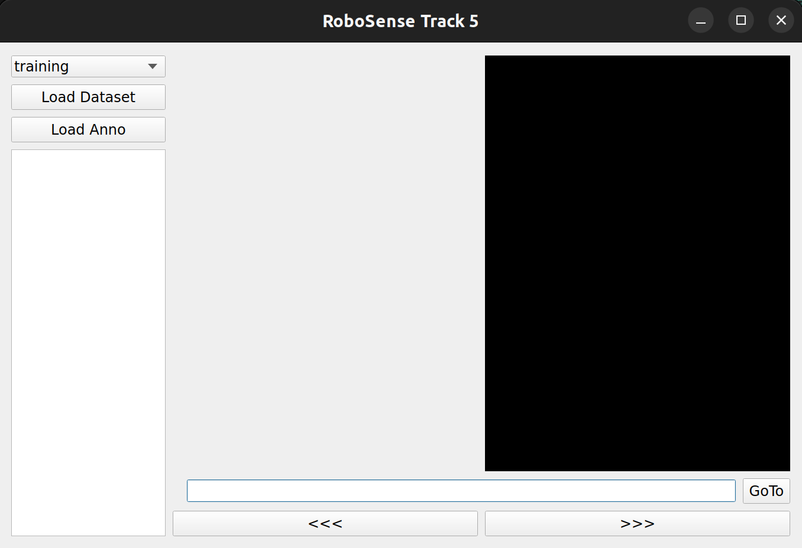
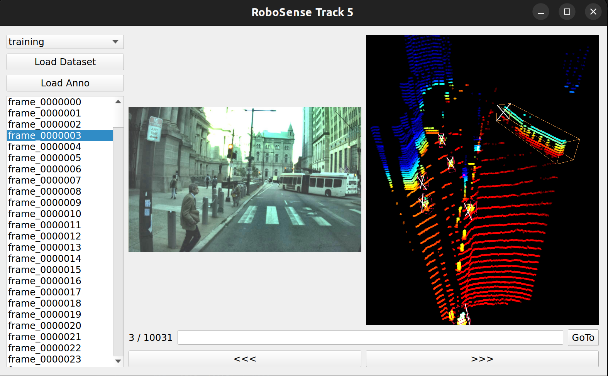

<div align="center">
  
</div>
<div align="center">

# The <a style="color: #ffc000;">Robo</a><a style="color: #76b900;">Sense</a> Challenge 2025
## Track <a style="color: #76b900;">#5</a>: Cross-Platform 3D Object Detection
</div>

<div align="center">
    
</div>

## Overview

- [Overview](#Overview)
- [News](#News)
- [Phases](#Phases)
- [Installation](#installation)
- [Getting Started](#getting-started)
- [Baseline Results](#baseline-results)
- [Visualization Tools for Track5](#visualization-tools-for-track5)
- [Acknowledge](#acknowledge)

## News
- [2025-07-04]: We have fixed the bug of 'mot_3d'
- [2025-06-12]: The RoboSense Challenge is online.

## Phases

<!-- | Phase                                        | Duration                    | Source Domain                                  | Target Domain                                | Ranking Metric                                                                                   |
|----------------------------------------------|-----------------------------|------------------------------------------------|-----------------------------------------------|--------------------------------------------------------------------------------------------------|
| **Phase 1: Vehicle → Drone Adaptation**      | 15 June 2025 – 15 August 2025 | Vehicle LiDAR scans **with** 3D bbox annotations | Unlabeled Drone LiDAR scans                  | AP@0.7 for **Car** class on Drone data                                                           |
| **Phase 2: Vehicle → Drone & Quadruped Adaptation** | 15 August 2025 – 15 October 2025 | Vehicle LiDAR scans **with** 3D bbox annotations | Unlabeled Drone **&** Quadruped LiDAR scans | Weighted score combining: <br>- AP@0.7 for **Car**<br>- AP@0.5 for **Pedestrian** <br>(computed across both Drone and Quadruped platforms) | -->


The Cross-Platform Track is structured into two consecutive phases:

### Phase 1: Vehicle → Drone Adaptation  
**Duration:** 15 June 2025 – 15 August 2025  
**Setup:**  
- **Source domain:** Vehicle LiDAR scans **with** 3D bounding-box annotations  
- **Target domain:** Unlabeled Drone LiDAR scans  
**Ranking metric:** AP@0.50 (R40) for the **Car** class evaluated on Drone data  

---

### Phase 2: Vehicle → Drone & Quadruped Adaptation  
**Duration:** 15 August 2025 – 15 October 2025  
**Setup:**  
- **Source domain:** Vehicle LiDAR scans with annotations  
- **Target domains:** Unlabeled Drone and Quadruped LiDAR scans  
**Ranking metric:** Weighted score combining:  
  - AP@0.50 (R40)  for the **Car** class  
  - AP@0.25 (R40)  for the **Pedestrian** class  
  (Scores computed across both Drone and Quadruped platforms.)  

## Installation

This track is developed on top of the popular 3D detection codebase [OpenPCDet](https://github.com/open-mmlab/OpenPCDet). To avoid build failures, **make sure your CUDA version matches your PyTorch installation** before proceeding. All the installation and testing process had beed tested with `PyTorch 2.1.0-cu118` on `Ubuntu 22.04`.

1. **Clone the repository**  
   ```bash
   git clone https://github.com/robosense2025/track5.git
2. **Enter the project directory**  
   ```bash
   cd track5
3. **Install dependencies**  
   ```bash
   pip install -r requirements.txt
4. **Build and install the `pcdet` package**  
   ```bash
   python setup.py develop
5. **Verify installation**  
   ```bash
   pip list | grep pcdet
If you run into any installation issues, please open an issue on the GitHub repo or contact us via the WeChat group. Happy coding!

## Getting Started

### Data Preparation

The Track 5 dataset follows the KITTI format. Each sample consists of:
- A front-view RGB image
- A LiDAR point cloud covering the camera’s field of view
- Calibration parameters
- 3D bounding-box annotations (for training)  
> Calibration and annotations are packaged together in `.pkl` files.

We use the **same training set** (vehicle platform) for both phases, but **different validation sets**. The full dataset is hosted on Hugging Face:

[robosense/track5-cross-platform-3d-object-detection](https://huggingface.co/datasets/robosense/datasets/tree/main/track5-cross-platform-3d-object-detection)

1. **Download the dataset**  
   ```bash
   python tools/load_dataset.py $USER_DEFINE_OUTPUT_PATH
2. **Link data into the project**  
   ```bash
    # Create target directory
    mkdir -p data/pi3det

    # Link the training split
    ln -s $USER_DEFINE_OUTPUT_PATH/track5-cross-platform-3d-object-detection/phase12_vehicle_training/training \
        data/pi3det/training

    # Link the validation split for Phase 1 (Drone)
    ln -s $USER_DEFINE_OUTPUT_PATH/track5-cross-platform-3d-object-detection/phase1_drone_validation/validation \
        data/pi3det/validation

    # Link the .pkl info files
    ln -s $USER_DEFINE_OUTPUT_PATH/track5-cross-platform-3d-object-detection/phase12_vehicle_training/training/pi3det_infos_train.pkl \
        data/pi3det/pi3det_infos_train.pkl
    ln -s $USER_DEFINE_OUTPUT_PATH/track5-cross-platform-3d-object-detection/phase1_drone_validation/validation/pi3det_infos_val.pkl \
        data/pi3det/pi3det_infos_val.pkl
3. **Verify your directory structure**  
After linking, your `data/` folder should look like this:
   ```bash
    data/
    └── pi3det/
        ├── training/
        │   ├── image/
        │   │   ├── 0000000.jpg
        │   │   └── 0000001.jpg
        │   └── point_cloud/
        │       ├── 0000000.bin
        │       └── 0000001.bin
        ├── validation/
        │   ├── image/
        │   │   ├── 0000000.jpg
        │   │   └── 0000001.jpg
        │   └── point_cloud/
        │       ├── 0000000.bin
        │       └── 0000001.bin
        ├── pi3det_infos_train.pkl
        └── pi3det_infos_val.pkl
    ```
### Source training

The purpose of Cross Platform is like an Unsupervised Domain Adaptation (UDA) task is to learn a generalized model or backbone $F$ on a labeled source platform $s$ and an unlabeled target platform $t$, such that the $F$ can be adapted to the new target platform $t$, where unlabeled training data (such as point cloud or images) from the target platform $t$ are assumed to be available during the adaptation process.

> Here, we take Phase1: Vehicle-to-Drone adaptation as an example. We use PVRCNN as our base detector.

* `OpenPCD` use `tools` as project workspace
```shell script
cd tools
```

* Train FEAT=3 (X,Y,Z) using multiple GPUs
```shell script
bash scripts/dist_train.sh ${NUM_GPUs} \
--cfg_file ./cfgs/DA/phase1_vehicle_drone/source_only/pvrcnn_source.yaml
```

* Train FEAT=3 (X,Y,Z) using single GPU
```shell script
python train.py --cfg_file ./cfgs/DA/phase1_vehicle_drone/source_only/pvrcnn_source.yaml
```

### Adaptation stage: self-training the source-platform on the unlabeled target-platform:

> Here, we take Phase1: Vehicle-to-Drone adaptation as an example. We use [ST3D](https://arxiv.org/abs/2103.05346) as our baseline method.

* Train FEAT=3 (X,Y,Z) using multiple GPUs
```shell script
sh scripts/UDA/dist_train_uda.sh ${NUM_GPUs} \
--cfg_file ./cfgs/DA/phase1_vehicle_drone/st3d/pvrcnn_st3d.yaml \
--pretrained_model ${PRETRAINED_MODEL}
```

* Train FEAT=3 (X,Y,Z) using single GPU
```shell script
python train_uda.py \
--cfg_file ./cfgs/DA/phase1_vehicle_drone/st3d/pvrcnn_st3d.yaml \
--pretrained_model ${PRETRAINED_MODEL}
```

`$PRETRAINED_MODEL` is pretrained from source platform in [Source training](#source-training).

### Evaluating the model on the target platform

The validation set for this track **does not** include annotation files. All results must be submitted and evaluated through the competition submission website. We have lifted any rate limits on validation submissions so you can evaluate as often as needed.


* Test with a ckpt file: 
```shell script
python test.py \
--cfg_file ${CONFIG_FILE} \
--batch_size ${BATCH_SIZE} \
--ckpt ${CKPT}
```

* To test all the saved checkpoints of a specific training setting and draw the performance curve on the Tensorboard, add the `--eval_all` argument: 
```shell script
python test.py \
--cfg_file ${CONFIG_FILE} \
--batch_size ${BATCH_SIZE} \
--eval_all
```

* To test with multiple GPUs:
```shell script
sh scripts/dist_test.sh ${NUM_GPUs} \ 
--cfg_file ${CONFIG_FILE} \
--batch_size ${BATCH_SIZE} \
--ckpt ${CKPT}
```

* To test all ckpts with multiple GPUs
```shell script
sh scripts/dist_test.sh ${NUM_GPUs} \
--cfg_file ${CONFIG_FILE} \
--batch_size ${BATCH_SIZE} \
--eval_all
```

🌃🌃🌃Once testing completes, you will find a `result.pkl` file in your output directory. Please compress the file directly to `result.zip`  and this file is your submission payload for the leaderboard.

&ensp;
&ensp;
## Baseline Results:
We report the cross-platform adaptation results including phase1 and phase2.
* All LiDAR-based models are trained with 2 NVIDIA T8 GPUs and are available for download. 
* The platform adaptation time is measured with 2 NVIDIA T8 GPUs and PyTorch 2.1.0-cu118.
### Phase1 results:

|                                              | Adaptation | Car AP0.7@R40 | Car AP0.5@R40 | download | 
|--------------------------------------------- |:-------:|:-------:|:-------:|:---------:|
| [PV-RCNN](tools/cfgs/DA/phase1_vehicle_drone/source_only/pvrcnn_source.yaml) | Source-only | 34.60 / 16.31 |40.67 / **33.70** | [checkpoint](https://huggingface.co/datasets/robosense/datasets/blob/main/track5-cross-platform-3d-object-detection/pretrained/pvrcnn_source.pth) |
| [PV-RCNN](tools/cfgs/DA/phase1_vehicle_drone/st3d/pvrcnn_st3d.yaml) | ST3D        | 47.81 / 26.03 |53.40 / **46.64** | [checkpoint](https://huggingface.co/datasets/robosense/datasets/blob/main/track5-cross-platform-3d-object-detection/pretrained/pvrcnn_st3d.pth) |
| [PV-RCNN](tools/cfgs/DA/phase1_vehicle_drone/st3d++/pvrcnn_st3d++.yaml) | ST3D++      | 45.96 / 25.37 |52.65 / **45.07** | [checkpoint](https://huggingface.co/datasets/robosense/datasets/blob/main/track5-cross-platform-3d-object-detection/pretrained/pvrcnn_st3d.pth) |

<p>
    Beyond the provided baseline, participants are encouraged to explore alternative strategies to further boost cross-platform performance:
</p>
<ul>
    <li>Treat the cross-platform challenge as a domain adaptation problem by improving pseudo-label quality and fine-tuning on target-platform data.</li>
    <li>Design novel data augmentation techniques to bridge geometric and feature discrepancies across platforms.</li>
    <li>Adopt geometry-agnostic 3D detectors, such as point-based architectures, that are less sensitive to platform-specific point-cloud characteristics.</li>
</ul>

## Visualization Tools for Track5
We provide a lightweight UI to help you **interactively explore** the dataset and your model's predictions. Before you begin, make sure you have downloaded and linked the data as described in [Getting Started](#getting-started).

### 1. Launch the UI

Run the following command in your project root:

```bash
python ./vis_tools/active_window.py
```

<div align="center">
    
</div>

### 2. Load the Dataset
  * Select Split
    * Use the dropdown menu at the top to choose **training** or **validation**.
  * Click Load Dataset
  * Inspect Views
    * Left panel: front-view RGB image
    * Right panel: LiDAR point cloud (FOV region)
    * Ground-truth 3D boxes are overlaid on LiDAR view.

<div align="center">
    
</div>

### 3. Visualize Prediction Results
* After testing, locate the `result.pkl` file in your output directory.
* Click Load Anno and select `result.pkl`.
* Predicted 3D bounding boxes will appear on point-cloud panels.

## Acknowledge
* Our code is heavily based on [OpenPCDet v0.5.2](https://github.com/open-mmlab/OpenPCDet). Thanks OpenPCDet Development Team for their awesome codebase.

* Our baselines are heavily based on [Project Link](https://bobrown.github.io/Team_3DTrans.github.io/). Thanks 3DTrans Development Team for their awesome codebase.